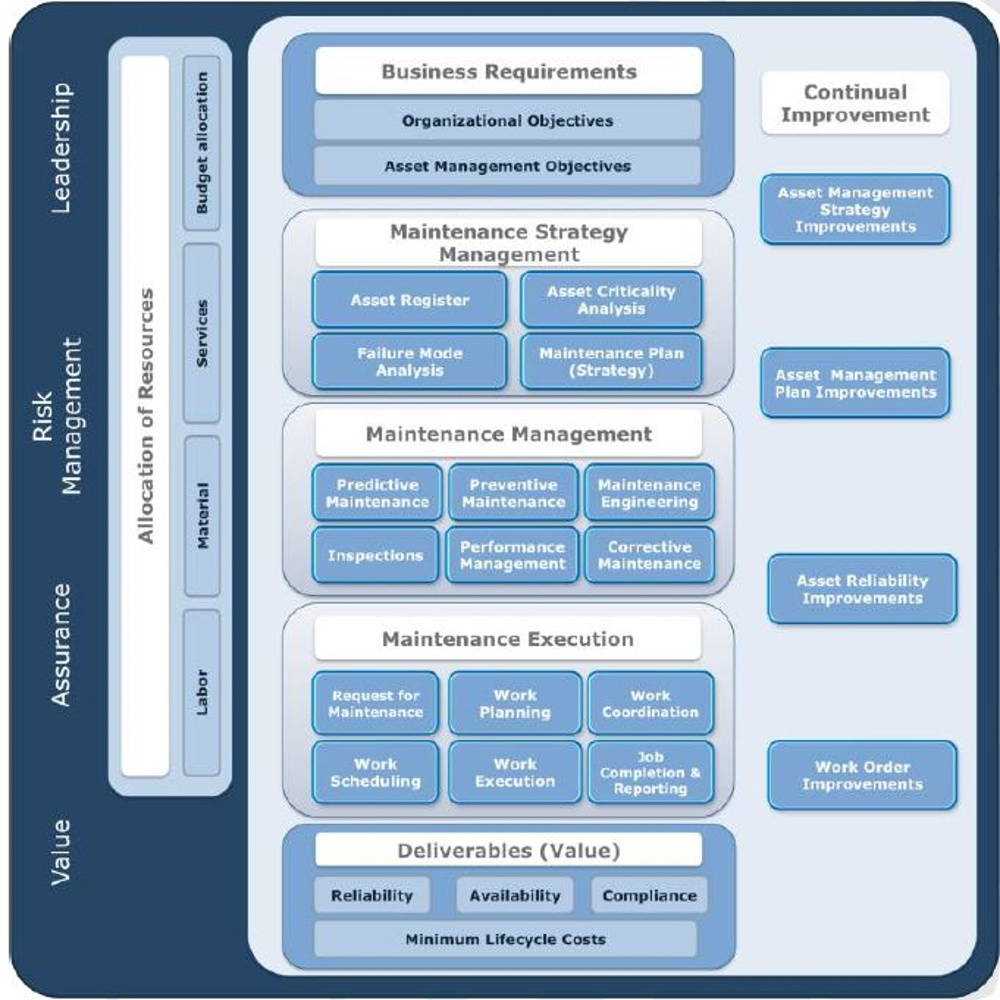
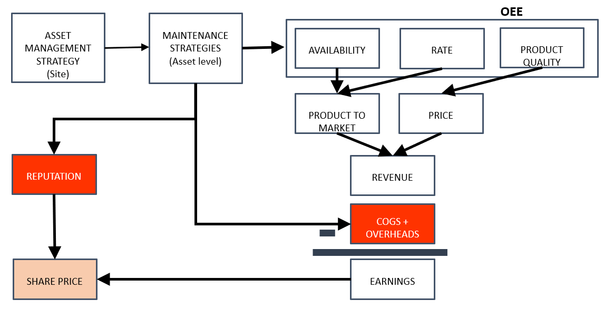

# Day 1 - Maintenance Work Management

## Activity

*In your own words what does Asset Management mean to you?*

*What is the difference between maintenance management and asset management?*

# Asset Management - the overarching framework

The International Standard ISO 55000, Asset management - Overview, principles and terminology (2014) defines `an asset` as an "item, thing or entity that has potential or actual value to an organization" and `asset management` as the "coordinated activity of an organization to realise value from assets".

Asset management (AM) is a whole of organisation approach to managing assets and encompasses much more that just the maintenance of physical equipment, or the maximising of yield from a financial portfolio. AM encompasses all asset types, tangible and intangible, individual components or complex systems, and all activities involved in the asset’s life cycle.

The AM community professional bodies have identified 39 areas of subject areas in AM grouped as follows: 1) Strategy and Planning, 2) AM Decision making, 3) Lifecycle delivery, 4) Asset information, 5) Organisation and people, 6) Risk and review. Decisions in all of these areas can be enhanced by use of data and models to help managers understand what has happened historically, explore scenarios for the future and consider, in a coherent way, the effect of uncertainties on outcomes. 

## Maintenance definitions.

CEN EN 13306 (2017) is the European Committe for Standardization's Maintenance - Maintenance Terminology Standard (2017) and specifies generic terms and definitions for the technical, administrative and managerial areas of maintenance. Many of the definitions given below are identica (or very close in intent) to the widely-used ISO 14224 (2016) standard.

`Maintenance` : combination of all technical, administrative and managerial actions during the life cycle of an item intended to retain it in, or restore it to, a state in which it can perform the required function.

`Required function` : function, combination of functions, or a total combination of functions of an item which are considered necessary to fulfil a given requirement.

Note 1 to entry: These targets may include for example availability, cost reduction, product quality, environment preservation, safety, useful life, asset value preservation.

## Our interest

Our interest in this course is specifically on data collected by 1)  maintenance technicians and planners in the course of work,  and by 2) reliability and mainteannce engineers as they develop and review asset maintenance strategies and work to manage the cost and reliability of the assets they are responsible for.

This data is primarily drawn from the following sources
* Computerised maintenance management system: a relational data base containing, for example, maintenance records, bills of materials, parts and costs data.
* FMEA and RCM records: Failure modes and effects analysis (FMEA) and Reliability-centred maintenance (RCM) records, usually captured in Excel spreadsheets
* RCA or warranty records: Root cause analysis investigations, captured in Excel spreadsheets or propietary software.

Although many maintenance related data science projects need it, the focus of this course is not on the following. 

* Operational data: sensor data drawn captured via IOT, SCADA or PLC systems, usually time-logged and numerical or binary.
* Data from other MES systems: Other manufacturing execution systems (MES) capture data specific to execution processes such as inventory management, production planning and dispatch, labour management, product management etc. 

## Maintenance Management Framework

The image below is from the Global Forum on Maintenance & Asset Management (GFMAM) Maintenance Framework 1st Edition 2016.

*Let us discuss the elements in this framework*

    

## Why is maintenance management important##

Some interesting facts
* Maintenance is a huge spend
* Capability Sustainment Program for Defence 2021-22 A$13.6 billion (excluding cost of Defence personnel)1
* A single company (for example a resource group like BHP spent US$3.5 billion a single year on maintenance in 2017)

*Apart from the costs, why is 'good' maintenance management important to organisations?*

    

<!--  -->

Maintenance strategy impacts the following:

1. Availability - Assets need to be available for the time required to achieve operational targets. 

2. Rate of production - Assets with degraded components may not operate at the required rate. For example, a worn pump will not produce the required flow and head. Taken together lower rates or production and lower availability impact the volume of PRODUCT TO MARKET.

3. Quality of product - Process plants need to be 'in control'. Plants, particularly slurry and chemical processes, where assets go on and off line unexpectedly, cause havoc in density levels and the reaction chemistries, resulting in lower recoveries/ product quality.  This directly affected the PRICE of your product.

4. Lower volume of PRODUCT TO MARKET and PRICE combine to impact your REVENUE.

5. Maintenance STRATEGY directly impacts COSTS. If you are doing too much preventative work or too much corrective work, and the work you are doing is not effective, then you are wasting money through your strategy.

5. Lower REVENUE and higher COSTS lead to lower EARNINGS and failure to meet production targets.

6. If you are a public listed company this can impact your REPUTATION in the market.

7. Maintenance STRATEGY also impacts the likelihood of Major Accident Events. If risks are not managed effectively then there can be serious impacts on REPUTATION in the event of loss of life and/or environmental damage.

*Why is an understanding of the above important for data scientists working on maintenance projects?*

## What do we mean by Maintenance Strategy?

In everyday English, maintenance strategy is the approach we have pre-determined as appropriate to ensure the asset delivers on it's maintenance objectives (availability, cost, safety etc). 

`Maintenance Strategy` : management method used in order to achieve the maintenance objectives. 

`Maintenance Objectives`: targets assigned and accepted for the maintenance activities.

Maintenance strategy for a specific asset is normally composed of a number of desired activities determined by a structured process or Original Equipment Manufacturer (OEM) specifications with intervals for each activity informed by cost, operating schedules etc.

These maintenance activity types are: 

* Failure finding, 
* Scheduled replacement, 
* Scheduled restoration, 
* Scheduled on-condition, 
* Run-to-failure and 
* Redesign. 

## Activity

*Give me a real-life example of each of these strategies, you can consider your car, home, bicycle, or an industry example*

## How do we know what strategy guided the work from the data in the CMMS?

Our day to day contact with the output of the maintenance strategy development process is the `Order Type` code used in the maintenance work orders (MWO) produced by our CMMS. 

`Preventative maintenance`  (EN13306:2017) is "maintenance carried out intended to assess and/or to mitigate degradation and reduce the probability of failure of an item"

Failure finding, scheduled replacement, scheduled restoration, scheduled on-condition are all examples of preventative maintenance activities.

`Corrective maintenance` is defined (EN13306:2017) as "maintenance carried out after fault recognition and intended to restore an item into a state in which it can perform a required function".

`Predictive maintenance` as "condition-based maintenance carried out following a forecast derived from repeated analysis or known characteristics and evaluation of the significant parameters of the degradation of the item".

## Let's look at some data

Go to code file ViewData.py

Examples of the CMMS field name containing strategy and execution related information are `Order Type` and `Priority`

Different companies use different codes and/or structured texts to indiciate the work type. For example.

Examples of codes used include (but are not limited to):
- `PM01`: Work generated from strategies stored in the CMMS (Routine `preventative` work)
- `PM02`: `Corrective` work, modification or improvement work
- `PM03`: `Corrective` work to be done immediate/ urgent work bypassing the planning and scheduling process

Often (usually) work orders generated as a result of `condition monitoring`, `inspections` and `predictive analytics` are coded as `corrective work`.

See [Rethinking maintenance terminology for an industry 4.0 future](http://www.papers.*phmsociety.org/index.php/ijphm/article/view/2932) for more details.

## Wrap up

*What are your key take-aways for today?*

### Further reading

[The Asset Management Landscape](https://theiam.org/knowledge-library/the-asset-management-landscape/)
