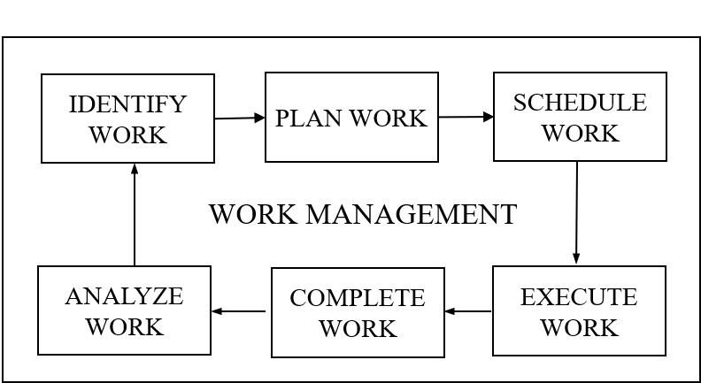
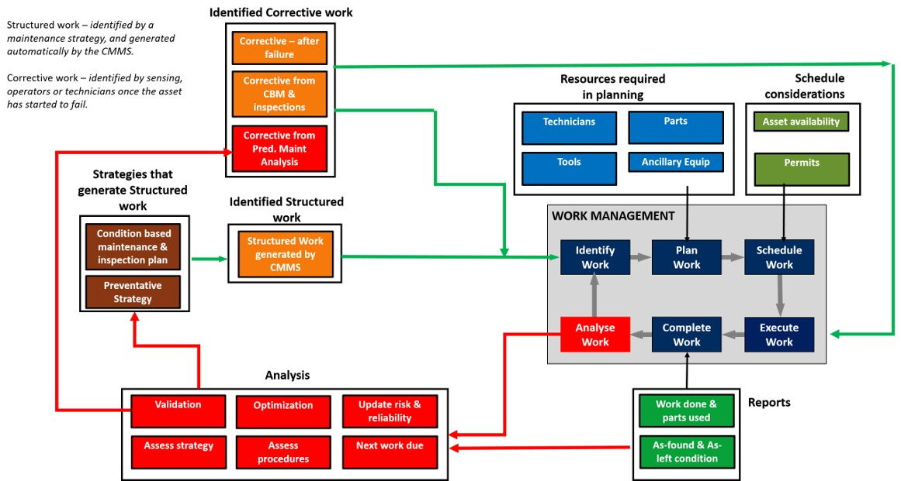
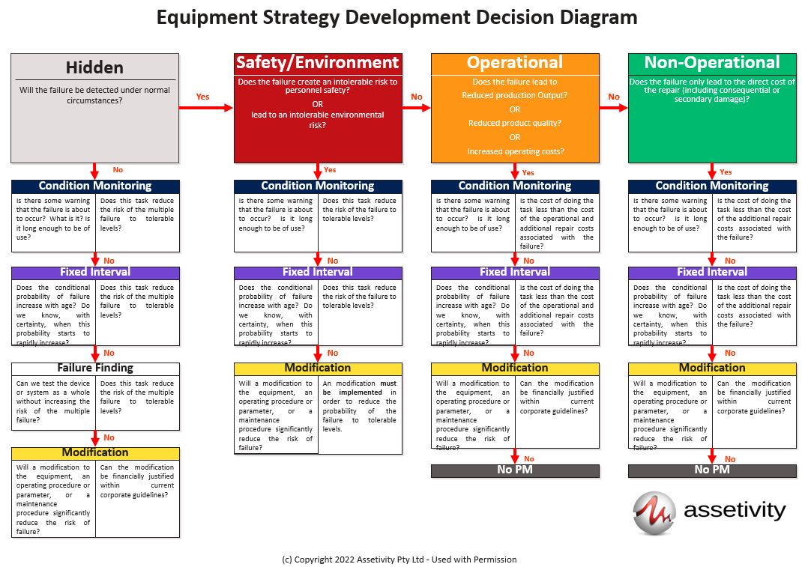
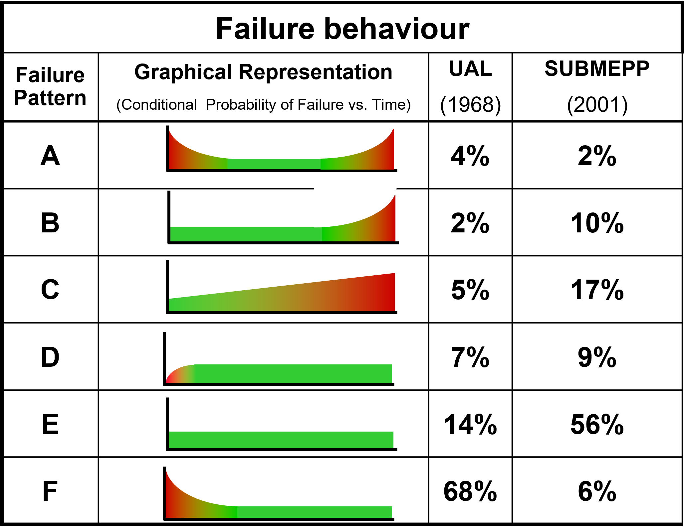
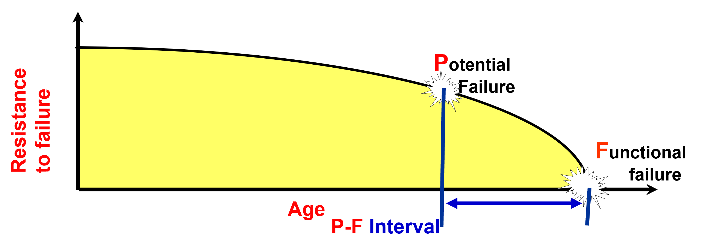

# Day 2 Maintenance Work Management

`Work management is key to delivering value in maintenance projects`

## Basic stages in work management

Each (and every!) maintenance work order needs to go through each of these stages.

Here is an example of fields in a typical MWO - showing what type of data about the stages is captured.

==Open bwr_wo-full.csv file in Excel==

Note these are just 5 records from >2000 for a single asset over 2 years on a site that has >1000 assets.

*Where is value delivered?*

    

*What do you think the time scale is here?*

## Work management has management metrics

There are a number of specific measures related to maintenance work management that Maintenance managers are accountable for. 

Common ones are:
`% Schedule compliance` = actual hours worked on scheduled work per the maintenance schedule/ total craft hours available to schedule

`% Planned work` = planned work executed / total labour hours used

Other measures include availability, cost, safety etc.

(Based on the SMRP Handbook 5th Ed.)

You can see from these that:

1. Unplanned work is unwanted.
2. Schedule breakers are unwanted.

*What does this mean for the data analyst?*

## Expanded view of maintenance work management

*Let's discuss what is going on in each stage and who is involved*

    

*Discussion*

## What is a failure?

Understanding `failure modes` is crucial when working on reliability and maintenance projects.

The first step to understanding a failure mode is to understand the notion of a `function` to an engineer.

`(Primary) Function`: what the owner or user of a physical asset or system wants it to do.

`Secondary function`: functions a physical asset or system has to fulfil apart from its primary function(s), such as those needed to fulfil regulatory requirements and those which concern issues such as protection, control, containment, comfort, appearance, energy efficiency and structural integrity.

From SAE JA1011/12

*What's the function of a car?*

Defining function for the asset, and for its constituent parts, is a key step in Systems Engineering and in the design process. This is true for hardware and software.

A `failure` is the loss of ability to perform the `required function`.

`Failure modes` are terms used to describe how `loss of function` is observed. 

Many data science projects are focused on trying to predict failure so it is vital to know exactly what failure you are trying to predict, in other words, what function is being lost. 

Engineers capture information about failure modes and their causes during design using a process called `FMEA`. This helps them to improve their design.

A FMEA is a systemised group of activities intended recognise and evaluate the potential failure of a product/process and its effect, identify actions which could eliminate or reduce the chance of a potential failure occurring, and document the process. 

A `FMECA` is an extension of a FMEA that considers the impact (criticality) of each failure mode.

Once a product has been made and is being put into service, reliability engineers working for the product operator will use FMEA outputs to set maintenance strategy.

### Steps in the FMEA process

- Define function: What are the function(s) and standards of performance of the asset/subsystem/ component (item) in the current operational context?
- Identify functional failures: In what way(s) can the item fail to fulfil its function
- Identify failure modes: How does the item fail?
- Identify failure causes: What is the cause(s) of each failure mode. A single FM can have multiple causes.
- Identify failure effect: For each failure mode and associated cause, what is the effect (on the asset and on the wider system)

    

## Understanding risk priority 

A Maintenance Strategy should be considered for all important failure modes. Determining importance is done based on asset criticality and often uses a `Risk Priority Number (RPN)`. 

RPN = Likelihood of failure x Consequence of failure x Detectability of failure

Where each is based on a scale (e.g 1-10). 
So a failure mode with a high likelihood, high consequence and low detectability will have an RPN between 25 and 30 where 30 is max.

*As a data scientist you should be asking if you are working on an important failure mode for the asset and what other failure modes are of a concern*
*Also ask about the maintenance strategy in place for that failure mode*

## Developing maintenance strategy

Decisions on what maintenance to do (and when) on an asset is determined by asset criticality and failure behaviour. Structured processes for this include such as `Reliability-centred Maintenance (RCM)` and Preventative Maintenance Optimisation (PMO). 

The RCM process involves a `Failure Modes and Effects Analysis (FMEA)` followed by the use of a decision-tree process to identify a suitable maintnance activity type for each high ranking failure mode. 

    

*Discuss the data of interest for a) condition monitoring, and b) fixed interval strategies*

*Note that failures that occur on assets/ subsystems/ components that have maintenance strategies in place are failures of either the strategy or the execution (noting the caveat that failure occurrence is probabilistic in nature* 

## Failure behaviours,

*Do you know what is the dominant failure behaviour of the failure mode you are modelling?*

Each of these plots has `hazard rate` against time where hazard rate (also known as instantaneous or conditional failure rate) is the probability of an item failing in the next time instance given it has survived thus far.

    

Many predictive maintenance data science projects involve condition and performance monitoring data.

## Condition monitoring

Condition monitoring tasks are applicable  when:
- There is a clearly defined potential failure condition
- The P-F interval can be reasonably defined
- The task can be done at a frequency which permits effective action to avoid the consequences of the failure
- The frequency of a condition monitoring task is determined by the P-F interval
- The P is the point at which a specific detection technique can detect  deterioration

    

*If you are working on a predictive maintenance modelling project then check that your algorithm can detect the defect with enough time to action a corrective maintenance event and have it scheduled through the maintenance management system in a controlled and organised way. This depends on the PF interval, detectability of the fault, efficiency of the algorithm AND the maintenance planning horizon (usually this is ~2 weeks).

## Examples

* `Modelling of blockage risk in vitrified clay wastewater pipes`
To cite this article: Qiang Xie, Chrianna Bharat, R. Nazim Khan, Andrew Best & Melinda Hodkiewicz (2016): Cox proportional hazards modelling of blockage risk in vitrified clay wastewater pipes, Urban Water Journal
To link to this article: http://dx.doi.org/10.1080/1573062X.2016.1236135

* `Managing streamed sensor data for mobile equipment prognostics`
Video - Correa et al. https://www.youtube.com/watch?v=tWFuKF3NSZM
Griffiths T, Corrêa D, Hodkiewicz M, Polpo A. Managing streamed sensor data for mobile equipment prognostics. Data-Centric Engineering. 2022;3:e11. 

* `Detection of Ragging in Wastewater Pump Stations using Condition Monitoring` - not publically available

## Homework
* Read this paper before next Monday
Kwon D, Hodkiewicz MR, Fan J, Shibutani T, Pecht MG. IoT-based prognostics and systems health management for industrial applications. IEEE Access. 2016;4:3659-70.
Open access at https://ieeexplore.ieee.org/abstract/document/7520653 

Prepare the following
* Identify an example of IOT-based PHM (from the literature or your own experience)
* Identify the business need
* Describe the data and information needed to support development of the model
* Identify the infrastructure necessary to support deployment and use in the business
* Identify challenges with development and implementation

Can be done as individuals or in a group.

## Wrap up

*What are your key take-aways for today?